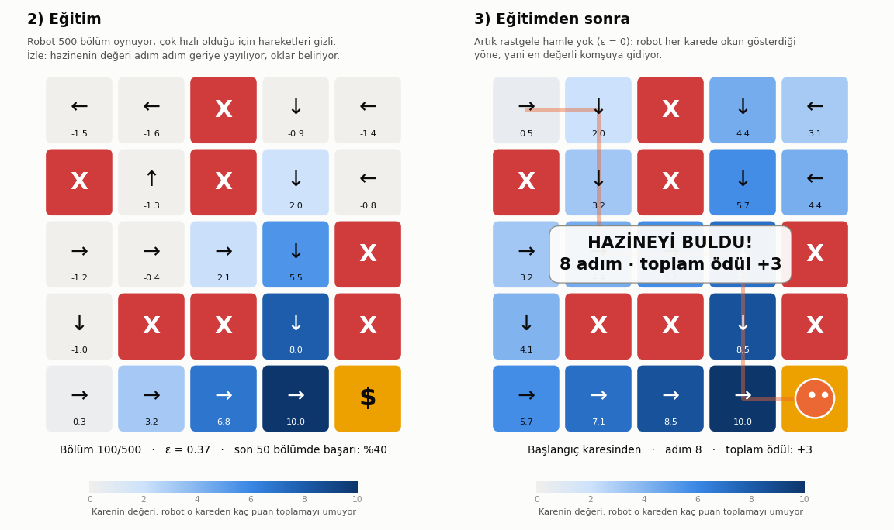

# Reinforcement Learning Tutorial

Reinforcement learning'i (pekiştirmeli öğrenme) küçük, uygulamalı projelerle öğrenme deposu. Her proje kendi numaralı klasöründe duruyor ve kodlar Türkçe açıklamalarla dolu.

| # | Proje | Öğrettikleri |
|---|---|---|
| 01 | [Hazine Avı](01_hazine_avi/) | Ajan, ortam, durum, eylem, ödül, Q-tablosu, Q-Learning, keşif-kullanım dengesi (ε-greedy) |

---

## 01 · Hazine Avı

Bir robot 5x5'lik bir ızgarada hazineyi arıyor. Haritayı bilmiyor: nerede tuzak, nerede hazine var, hiçbir fikri yok. Tek bildiği, her hamlesinden sonra aldığı puan:

| Olay | Ödül |
|---|---|
| Hazineyi bulmak (`$`) | +10, bölüm biter |
| Tuzağa düşmek (`X`) | −10, bölüm biter |
| Her normal adım | −1 |

Robot, Q-Learning ile deneme-yanılma yoluyla hazineye giden en kısa ve güvenli yolu kendi kendine öğreniyor. Ortam, ajan ve öğrenme kuralı sıfırdan yazıldı; hazır bir RL kütüphanesi kullanılmadı.



### Kurulum

Python 3 (3.11 ile test edildi), numpy ve matplotlib yeterli:

```bash
pip install numpy matplotlib
```

Conda kullanıyorsan bu paketlerin yüklü olduğu ortamı etkinleştirmen yeterli: `conda activate <ortam_adı>`.

### Robotun öğrenmesini canlı izle

```bash
cd 01_hazine_avi
python canli.py
```

Bir pencere açılır ve yaklaşık 30 saniyede üç perde oynar:

1. **Eğitimden önce:** Robot hiçbir şey bilmiyor ve rastgele hareket ediyor. Üç denemenin üçünde de tuzağa düşüyor.
2. **Eğitim:** Robot 500 bölüm oynuyor. Kareler robotun beynine (Q-tablosuna) göre boyanıyor: hazinenin değeri adım adım geriye doğru yayılıyor, öğrendiği yönler ok olarak beliriyor.
3. **Eğitimden sonra:** Robot okları takip ederek hazineye gidiyor: önce başlangıç karesinden (8 adım, +3 puan), sonra iki rastgele kareden.

| Penceredeki işaret | Anlamı |
|---|---|
| Turuncu top | Robot (gözleri gittiği yöne bakar) |
| Turuncu çizgi | Robotun izlediği yol |
| Kırmızı `X` / sarı `$` | Tuzak / hazine |
| Karedeki sayı | Robotun o kareden toplamayı umduğu puan (en büyük Q-değeri) |
| Ok | Robotun o karede seçeceği hamle, yani öğrendiği **politika** |

Pencereyi kapatınca program biter. Animasyonun hızını `canli.py`'nin başındaki ayarlardan (`FRAME_DELAY`, `PAUSE` vb.) değiştirebilirsin.

> **Pencere açılmıyorsa:** matplotlib'in pencere açabilmesi için Tk ya da Qt gerekir. Ubuntu'da `sudo apt install python3-tk` ya da `pip install PyQt6` ile kurabilirsin.

### Terminalde çalıştır

```bash
cd 01_hazine_avi
python hazine_avi.py
```

Haritayı, eğitimden önceki ve sonraki oyunları, eğitim tablosunu ve robotun beynini (değer ve politika haritaları) terminale yazar; öğrenme eğrisini `ogrenme_egrisi.png` olarak kaydeder. Yarım saniyede biter.

### Dosyalar

| Dosya | İçinde ne var |
|---|---|
| [`hazine_avi.py`](01_hazine_avi/hazine_avi.py) | RL'in kendisi: ayarlar, ortam (`TreasureHuntEnv`), ajan (`QLearningAgent`) ve eğitim döngüsü. **Okunacak dosya bu.** |
| [`canli.py`](01_hazine_avi/canli.py) | Canlı izleme penceresi |
| [`gorsel.py`](01_hazine_avi/gorsel.py) | Terminal çıktıları ve öğrenme eğrisi grafiği |

Algoritmanın kalbi, `QLearningAgent.learn` içindeki Q-Learning güncellemesi:

```
Q(s,a) ← Q(s,a) + α · [ r + γ · max Q(s',·) − Q(s,a) ]
```

### Kendin dene

`hazine_avi.py`'nin başındaki ayarlardan birini değiştir, sonra `canli.py`'yi ya da `hazine_avi.py`'yi yeniden çalıştır:

| Değiştir | Ne olur | Ders |
|---|---|---|
| `RANDOM_START = False` | Robot yolu yine bulur ama uğramadığı köşeler soluk kalır, oradaki oklar duvara döner | Uğramadığın yeri öğrenemezsin |
| `GAMMA = 0.0` | Robot başlangıçta duvara çarpıp yerinde sayar | γ = 0 iken robot yalnızca bir sonraki ödülü görür, geleceği hesaba katmaz |
| `N_EPISODES = 30` | Robot bir adım attıktan sonra takılır | Öğrenmek için yeterince deneyim gerekir |
| `GRID` | Kendi çizdiğin harita | Tuzak ekle, hazineyi başka yere taşı |
